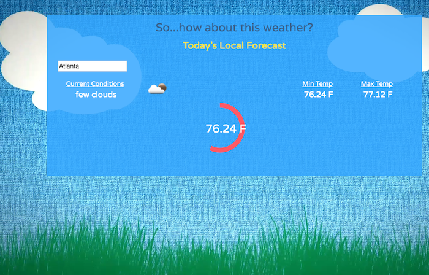

#Weather Widget Appliction

###This is a Weather Widget application that allos the user to enter in a US city and the current local forcast is displayed with the temperature ( Max and Min) and  the current conditions. 




Visit here: [Weather widget](http://shirletterly.com/weatherapp/)

##Built with:
	- Html
	- CSS
	- Javascript
	- jQuery 
	- JSON
	- Weather API
	- Bootstrap

##Sample Code
###The following code uses jQuery to pull from a JSON file using a weather API.

```javascript
//get the JSON from the constructed URL
			$.getJSON(url, function(weatherData){
				console.log(weatherData);
				//set up a variable for the user's city temp
				currentTemp = weatherData.list[0].main.temp;
				currentMax = weatherData.list[0].main.temp_max;
				currentMin = weatherData.list[0].main.temp_min;
				weatherIcon = weatherData.list[0].weather[0].icon;
				weatherDescription = weatherData.list[0].weather[0].description;
				console.log(weatherDescription)
				$('.maxTemp').html("<span>Max Temp</span> <br>"+currentMax + ' F');
				//$(currentMax).css("{}");

				$('.minTemp').html("<span>Min Temp</span> <br>"+currentMin + ' F');
				//$(currentMax).css("{}");

				$('.description').html("<span>Current Conditions</span> <br>"+weatherDescription);

				var src1 = "http://openweathermap.org/img/w/"+weatherIcon+".png";
				$('.weather-icon').attr("src", src1);

				animate(0);
			});
```


####Early stages of the widget


<!-- add a video of interaction with the site -->

##Future Add-ons
- Different images the generate for each weather category
- Weekly forecast with highs and lows.
- Added user interaction capibilites.


###Please visit my personal profile to see more current projects.
- [Shirlette Chambers](https://github.com/Shirlazybrat)
